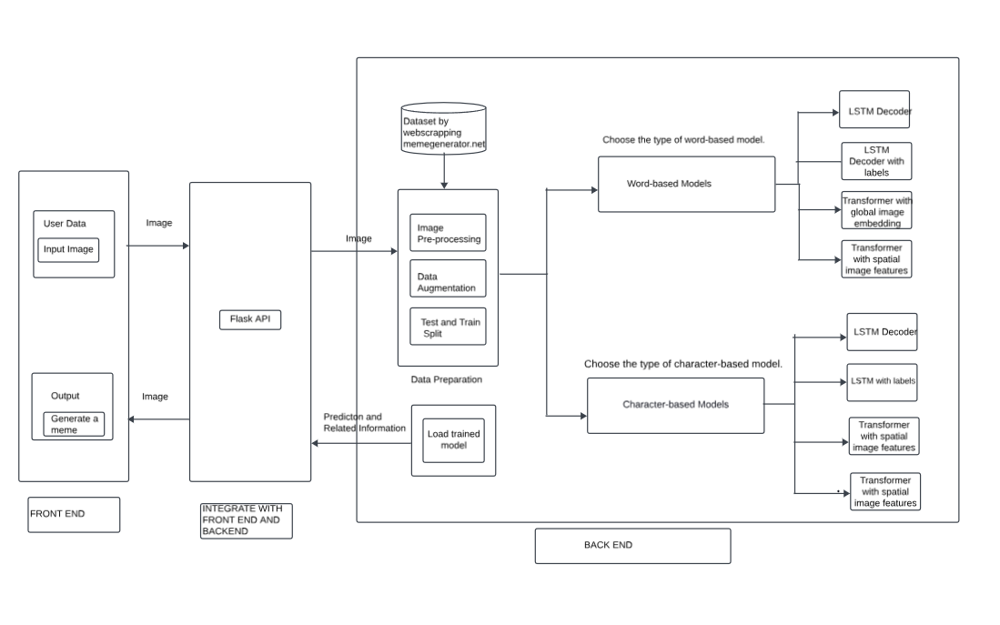

# Project Title: Meme Magic - A Random Meme Generator

## Description
Meme Magic is an innovative application that creates random memes from a given image. We utilized front-end technologies like HTML, CSS, JavaScript, and Bootstrap to create an intuitive and responsive user interface. The back-end models, written in Python, were connected using Flask for efficient processing and data handling. Finally, the application was deployed on Streamlit for a seamless user experience.

## Why did we build this project?
The primary motivation behind the development of MemGen is to spread laughter and joy by leveraging the creative potential of memes. Memes are a unique cultural phenomenon that combine humor with visual and textual elements, making them highly engaging and shareable.

## Benefits:
1. **Connect People**: Memes have the power to connect people by breaking the ice and fostering a sense of camaraderie and humor.
2. **Social Connections**: By using memes, users can bond over shared jokes and cultural references, creating deeper social connections.

## Targeted Audience:
1. **Professionals**: MemGen can be a valuable tool for professionals looking to create engaging content for campaigns.
2. **Educators**: Memes can be used to make educational content more relatable and memorable.
3. **General Users**: MemGen appeals to anyone looking to create and share memes for fun or to build an online presence.
4. **Content Creators**: Influencers and content creators can use MemGen to produce unique and entertaining content for their audiences.

## What problems does it solve?
1. **Dataset Issues**: Existing meme datasets were either incomplete, imbalanced, or not publicly available. MemGen addresses this by collecting and releasing a large-scale, balanced dataset of 900,000 memes with 300 different templates.
2. **Model Accuracy**: By incorporating advanced models and techniques such as LSTM, CNN, and Transformers with spatial features, MemGen enhances the accuracy and quality of generated meme captions. The project demonstrated that LSTM-based models perform better in generating coherent captions compared to transformer-based models.
3. **Data Cleaning**: The project involved rigorous data preprocessing steps to remove noise, non-ASCII symbols, non-English text, and high-similarity captions, resulting in a cleaner and more usable dataset.

## Features

Here is the architecture diagram of our system, illustrating the different components and their interactions.

<div style="display:flex; justify-content:center;">
    <div style="flex:1; margin-right:5px;">
        <p align="center">
            
            <br>
            <strong>Original Image</strong>
        </p>
    </div>
    <div style="flex:1; margin-left:5px;">
        <p align="center">
            
            <br>
            <strong>Generated Image of Meme</strong>
        </p>
    </div>
</div>

Difference Between Generated Meme and Original Image

You can upload any image from your system, select a model, and provide input text to generate a random meme and you will have an option to download an image.


## How to use
1. Install the required packages:
```sh
pip install -r requirements.txt
```
2. Running Flask APP:
```sh
flask --debug run
```
3. Running Streamlit:
```sh
streamlit run streamlit_app.py
```

## Technologies

- Python
- TensorFlow
- PyTorch
- Google Colab
- HTML
- CSS
- Bootstrap
- JavaScript
- ReactJS
- Streamlit
- Fast API

## Collaborators

- [Hrudaya Jinna](https://github.com/hrudayajinna)
- [Aksheetha Muthunooru](https://github.com/aksheetha)
- [Anurag Sharma](https://github.com/asharma3196)
- [Yukta Medha](https://github.com/yuktamedha)


